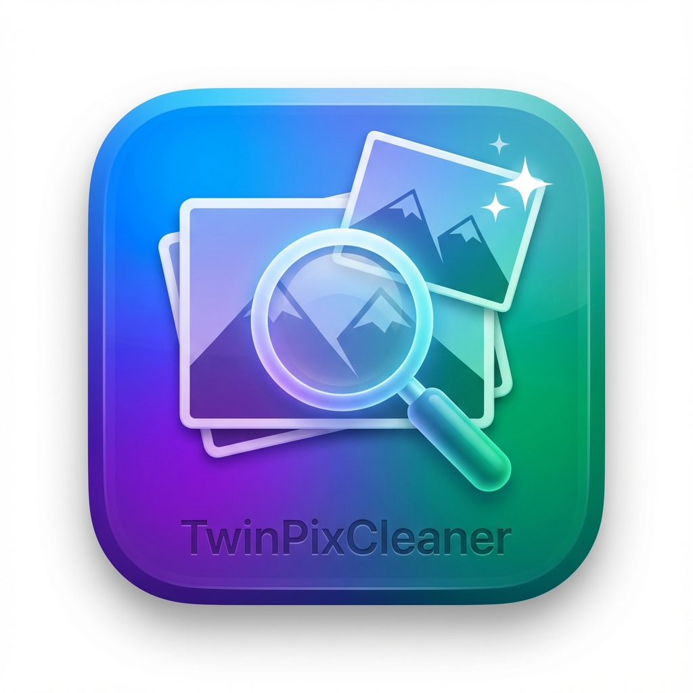
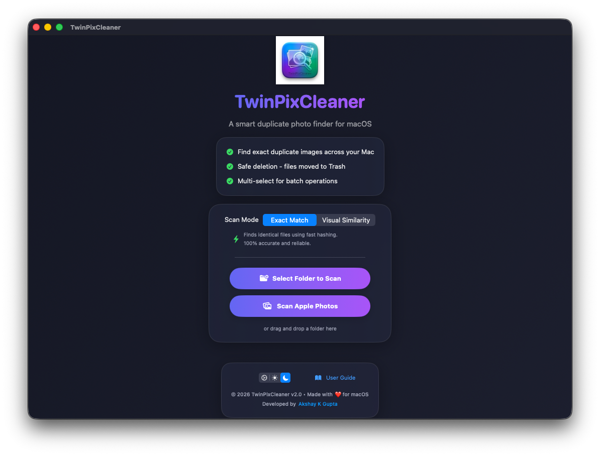
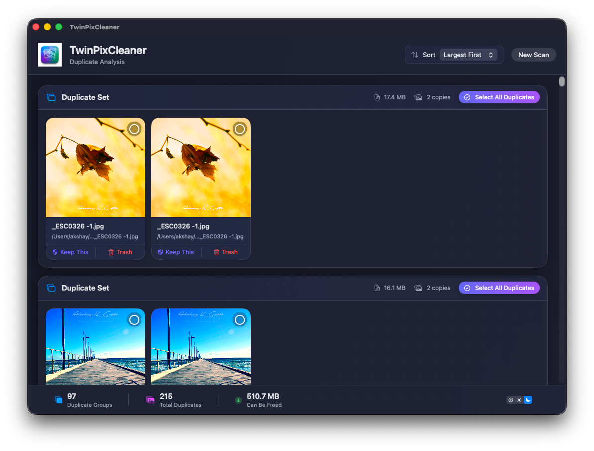

# TwinPixCleaner

<p align="center">
  
</p>

<p align="center">
  <strong>AI-powered duplicate photo cleaner for macOS with visual similarity detection.</strong><br>
  Find and remove duplicate images to free up disk space
</p>

<p align="center">
  
  
  
  
</p>

---

<p align="center">
  
  <br>
  <em>Choose folders or Apple Photos to detect duplicate and visually similar images using Apple Vision intelligence.</em>
</p>

 

AI-Powered (Apple Vision Intelligence powered) duplicate photo cleaner for macOS.

Find:
* Exact duplicate Photos
* Visually similar images
* Burst shots
* Duplicate screenshots
* Large unused images

Built with SwiftUI + Apple Vision Framework.

## 🎯 Why TwinPixCleaner
Unlike traditional duplicate cleaners, TwinPixCleaner can detect visually similar images even when:
- filenames differ
- resolutions change
- images are cropped
- screenshots are edited

<p align="center">
  
  <br>
  <em>Automatically group exact duplicates and similar images for fast and efficient cleanup.</em>
</p>

## ✨ Features

- 🔍 **Dual Scanning Modes** - Choose between pure SHA-256 hashing or AI-powered Visual Similarity
- 📸 **Apple Photos Integration** - Securely scan your entire macOS/iCloud Photos library via native PhotoKit
- 🎯 **100% Accurate** - Finds exact duplicates safely, or visually identical variations
- 🛡️ **Smart Selection** - 1-click "Keep This" workflow to select all duplicates except your favorite
- 🗑️ **Safe Deletion & Undo** - Files moved to Trash or Photos "Recently Deleted" Album; an on-screen Undo toast and ⌘Z both restore them instantly
- ✅ **Multi-Select** - Select multiple images for batch deletion
- 👁️ **Native Quick Look** - Press Spacebar for instant, full-resolution interactive previews
- 📊 **Smart Sorting** - Sort by size or number of copies
- 🧊 **Frost Glass UI** - Stunning, interactive native macOS interface with dark mode support, tinted to match your macOS accent color
- ⌨️ **Keyboard Shortcuts** - ⌘N for new scan, Delete to remove files, ⌘Z to undo
- ♿ **Accessible** - Full VoiceOver support, Full Keyboard Access, and Reduce Motion honored throughout
- 🔒 **Privacy First** - All processing happens locally, no data leaves your Mac

## 📥 Installation

### Option 1: Download Release (Recommended)
1. Download the latest release from [Releases](https://github.com/AkshayKrGupta/TwinPixCleaner/releases)
2. Open the DMG file
3. Drag TwinPixCleaner to your Applications folder
4. Launch from Applications

### Option 2: Build from Source
```bash
# Clone the repository
git clone https://github.com/AkshayKrGupta/TwinPixCleaner.git
cd TwinPixCleaner

# Build release version
swift build -c release

# Run the app
./.build/release/TwinPixCleaner
```

### ⚠️ Troubleshooting: "Apple could not verify..." Error
Since this app is open-source and not notarized by Apple, macOS Gatekeeper may show a warning when you try to open it for the first time. To open it safely:

**Method 1 (Recommended):**
1. Open **Finder** and go to where the app is located (e.g., your Applications folder).
2. **Right-click** (or Control-click) on `TwinPixCleaner.app`.
3. Select **Open** from the context menu.
4. Click **Open** on the warning dialog.

**Method 2 (If Method 1 doesn't show an "Open" button):**
1. Try to open the app normally by double-clicking it.
2. Go to **System Settings > Privacy & Security**.
3. Scroll down to the **Security** section.
4. Look for a message saying *“TwinPixCleaner” was blocked from use* and click **Open Anyway**.

*(You only need to do this once. After that, you can open the app normally by double-clicking it.)*

## 🚀 Quick Start

1. **Launch TwinPixCleaner**
2. **Select a folder** to scan, or click **Scan Apple Photos**
3. **Review duplicates** - sorted by size by default
4. **Select files** to delete (click to select, ⌘-click for multiple)
5. **Delete** - Press Delete key or click "Delete Selected"
6. **Done!** - Files are safely moved to Trash

## 📖 User Guide

### Scanning for Duplicates

**Method 1: Button**
- Click "Select Folder to Scan"
- Choose any folder on your Mac
- Wait for scan to complete

**Method 2: Drag & Drop**
- Drag any folder onto the app window
- Scan starts automatically

**Method 3: Apple Photos Library**
- Click "Scan Apple Photos"
- Grant permission to access your Photos library
- App securely scans your entire library without reading raw files

**Method 4: Keyboard Shortcut**
- Press ⌘N to start a new scan

### Understanding Results

The results view shows:
- **Duplicate Groups**: Sets of identical images
- **File Size**: Size of each duplicate file
- **Copies**: Number of duplicates found
- **Potential Savings**: Space you can free up

### Sorting Options

Use the sort dropdown to prioritize:
- **Largest First** (default) - Free up space quickly
- **Smallest First** - Start with small files
- **Most Copies** - Files with most duplicates
- **Fewest Copies** - Files with fewer duplicates

### Selecting Files

- **Single Click**: Select/deselect one file
- **"Keep This" Button**: Instantly keeps the chosen photo and flags all identical siblings for deletion
- **Delete Key**: Delete all selected files
- **Spacebar / Eye Icon**: Open native Quick Look preview
- **Hover**: View file details (name, path, metadata, size)

### Safe Deletion & Undo

- All deleted files go to **macOS Trash**
- **Undo Mistakes**: Simply press ⌘Z to instantly restore files deleted in your current session
- You can recover files from Trash before emptying
- No permanent deletion without your confirmation

## 🔒 Privacy & Permissions

### Required Permissions

**File Access**
- TwinPixCleaner needs permission to read folders you select
- Granted automatically when you choose a folder

**Photos Library** (If using Apple Photos Scan)
- Needs permission to access and delete photos from your library
- Safe deletion moves photos to the native "Recently Deleted" album

**Full Disk Access** (Optional)
- Required for system folders and external drives
- Enable in: System Settings → Privacy & Security → Full Disk Access
- Add TwinPixCleaner to the list

### Privacy Guarantee

✅ **100% Local Processing** - No cloud, no servers  
✅ **No Data Collection** - We don't track anything  
✅ **No Internet Required** - Works completely offline  
✅ **Open Source** - Verify the code yourself  

Read our full [Privacy Policy](PRIVACY.md)

## ⌨️ Keyboard Shortcuts

| Shortcut | Action |
|----------|--------|
| ⌘N | New Scan |
| Spacebar | Toggle Quick Look Preview |
| Delete/Backspace | Delete Selected Files |
| ⌘Z | Undo Last Deletion |
| ⌘W | Close Window |
| ⌘Q | Quit App |

## 🛠️ Technical Details

- **Language**: Swift 6.0
- **UI Framework**: SwiftUI
- **Minimum macOS**: 13.0 (Ventura)
- **Architecture**: Apple Silicon & Intel
- **Duplicate Detection**: SHA-256 (CryptoKit) & Feature Prints (Vision ML)
- **File Operations**: Native FileManager APIs with UndoManager integration

## 📊 Performance

- Scans **1,000+ images** in seconds
- Handles **large libraries** (10,000+ files)
- Low memory footprint
- Optimized for Apple Silicon

## 🤝 Contributing

Contributions are welcome! Please:
1. Fork the repository
2. Create a feature branch
3. Make your changes
4. Submit a pull request

## 📄 License

This project is licensed under the Apache License 2.0.
You are free to use, modify, and distribute this software in accordance with the license terms.
See the [License](LICENSE) file for details.

## 💼 Commerical Usage

While the Apache-2.0 license permits commercial usage, please consider contributing back to the project and respecting the original work and branding of TwinPixCleaner.

## 👨‍💻 Developer

**Akshay K Gupta**  
[LinkedIn](https://www.linkedin.com/in/akshay-kr-gupta/)

## 🐛 Support

Found a bug or have a feature request?
- Open an [Issue](https://github.com/AkshayKrGupta/TwinPixCleaner/issues)
- Contact via [LinkedIn](https://www.linkedin.com/in/akshay-kr-gupta/)

## ⭐ Show Your Support

If you find TwinPixCleaner useful, please:
- ⭐ Star this repository
- 📢 Share with friends
- 💬 Leave feedback

---

<p align="center">
  Made with ❤️ for macOS
</p>
